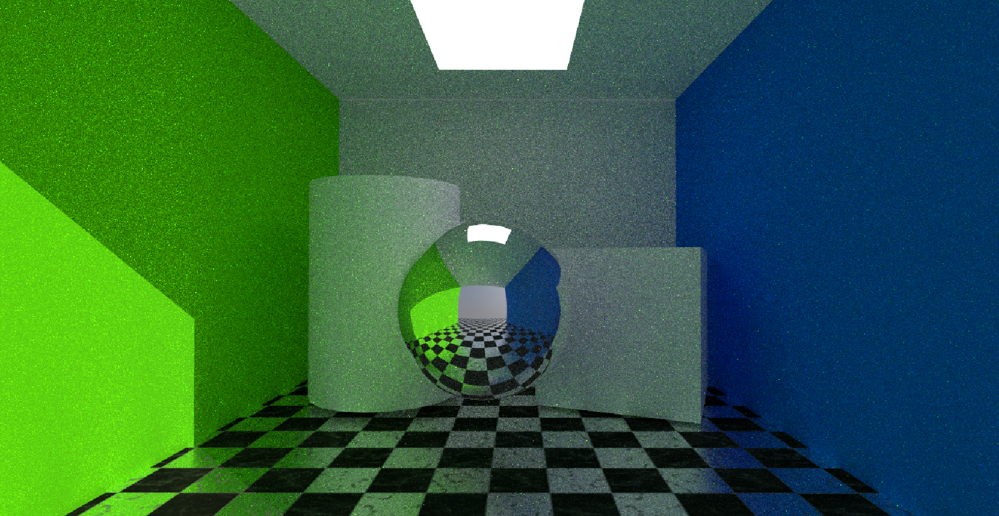

# Real-Time Software Ray Tracing in Unity BRP

---

**Engine**: Unity 6 Build-in Render Pipeline

**Tech Stack**: C#, HLSL (Compute Shaders)

## Abstract

This project explores a real-time **software-based ray tracer** built from scratch in Unity, leveraging compute shaders instead of relying on hardware-accelerated ray tracing APIs. It implements spatial acceleration with a Bounding Volume Hierarchy (BVH), recursive light transport including reflections and indirect lighting, and a procedural sky.

---

## System Architecture

### 1. Scene Data Conversion

The `RayTracingController` collects all scene meshes and materials, flattens geometry, extracts textures, and packs material data into compute buffers. Each mesh is stored as:

- Vertices, normals, tangents
- UVs
- Triangle indices
- Material index

Textures are grouped into a `Texture2DArray`.

### 2. BVH Construction

A Surface Area Heuristic (SAH) based **binary BVH** is built on the CPU.
The BVH implementation is not yet production-ready, it was a simple, straightforward approach designed primarily to 'just make it work.'

### 3. Compute Shader Dispatch

At render time, the ray tracing shader is dispatched with a thread group per screen tile. Each kernel thread:

1. Generates a primary ray from the camera
2. Traverses the BVH
3. Tests triangle intersections
4. Computes lighting:

   * Direct (via ray tracing or raster fallback)
   * Indirect (simulated bounces)
   * Reflections
   * Ambient Occlusion (This feature is experimental. All materials, including emissive ones, are affected by occlusion, and it is highly performance-intensive.)

### 4. Temporal Accumulation

If enabled, each frame's result is blended with prior frames to reduce noise. Controlled via `SamplesPerPixel`.

---

## Features

| Feature                   | Status       | Notes                                                                 |
|---------------------------|--------------|-----------------------------------------------------------------------|
| BVH Acceleration          | ✅ (partial) | SAH-optimized, stackless traversal. Still a basic SAH implementation; needs improvement. |
| Reflections               | ✅            | Recursive up to `MaxBounces`.                                        |
| Indirect Lighting         | ✅ (partial) | Basic hemispherical bounce approximation. Normal/bump maps not fully supported; needs improvement. |
| Ambient Occlusion         | ⚠️ Experimental | Hemisphere sampling. High performance cost. Experimental feature.    |
| Temporal Denoising        | ✅            | Optional sample accumulation over frames.                            |
| Procedural Sky            | ✅            | Gradient skybox with day/night parameters.                           |
| Texture Sampling          | ✅            | Uses `Texture2DArray` for batched material maps.                     |
| Shadows                   | ✅ (partial) | Ray-traced for directional lights only. Can be extended to other light types. |
| Raster Fallback Composing | ✅            | Blends raster and ray-traced output.                                 |
| Denoiser                  | ❌            | Uses temporal denoiser for static scenes only. Spatial denoiser can be added if needed. |

---

## Parameters (Inspector)

| Parameter                     | Description                                  |
| ----------------------------- | -------------------------------------------- |
| `ResolutionScale`             | Full, Half, or Quarter rendering resolution  |
| `MaxBounces`                  | Number of ray bounces (1–32)                 |
| `SamplesPerPixel`             | Per-frame sampling count for denoising       |
| `useTemporalCapture`          | Enables frame blending over time             |
| `EnableReflection`            | Recursive mirror-like surface support, require 'Indirect Light'        |
| `EnableRayTraceDirectLight`   | Enables ray-traced direct lighting           |
| `EnableRayTraceIndirectLight` | Enables simulated global illumination require, 'Direct Light' for better result, it using ambient indirect without it         |
| `EnableAmbientOcclusion`      | Enables AO via hemisphere rays, require 'Indirect Light'               |
| `CombineWithRasterize`        | Blends raster and ray-traced images          |
| `TextureSize`                 | Size for material texture array (e.g., 1024) |

---

## Limitations

* No caustics or path-traced energy conservation
* Transparency is basic (alpha only)
* No support for dynamic mesh deformation or skinning
* Performance drops sharply with high bounce/sample counts
* AO is slow and not optimized
* Indirect lighting is estimated, not accurate GI
* Only directional light shadows are ray-traced
* No spatial denoiser
* Normal/Bump mapping still not work properly

---

### Compute Pipeline

* Ray generation: camera rays per pixel
* BVH traversal: closest-hit test
* Shading: Lambertian + Blinn highlights
* Reflection: mirror with roughness
* Temporal denoising: exponential moving average

---

## Usage Instructions

1. Open Unity
2. Add `RayTracingController` to your **Main Camera**
3. Assign the `RayTracing.compute` shader in the Inspector
4. Configure parameters:
   * Samples per pixel
   * Max bounces
   * Texture size
5. Enable `ExecuteInEditMode` to view results in Scene view
6. Optionally toggle other features (AO, GI, Sky, BVH Debug, etc.)
7. Or you can use SampleScene directly

---

## License

This project is licensed under the MIT License.
Use it freely for learning, modification, or integration into your own experiments.

---
